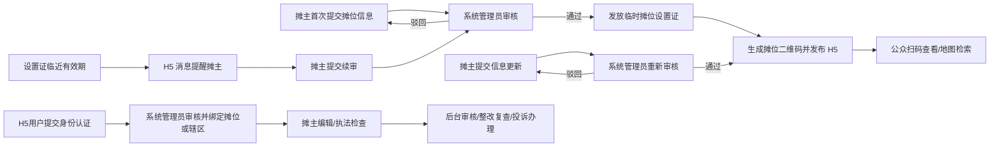

# 鹅码通 PC 管理后台业务需求梳理文档

## 文档信息

| 项目 | 内容 |
| --- | --- |
| 项目名称 | 鹅码通摊位信息与便民服务管理平台 |
| 工作模式 | 资料整理模式 |
| 输出深度 | standard |
| 版本 | V0.4（补充摊位审核、二维码生成及设置证续审） |
| 更新时间 | 2026-07-16 |
| 输入资料 | H5 交互原型、既有原型说明、旧 PC 后台原型 |

## 一句话场景描述

系统管理员通过 PC 后台统一维护摊位公开档案、地图便民服务点、H5 用户身份及监管事项，使公众扫码查询、附近检索、摊主自助维护和执法检查形成可审核、可追溯的业务闭环。摊主、执法者及普通用户均不能进入管理后台。

## 业务背景与建设动因

当前 H5 已明确三类公开与登录后场景：公众扫码查看摊位信息、公众在地图检索附近服务、用户登录后按未认证/摊主/执法者身份办理个人与工作事项。PC 后台需要成为这些信息的唯一管理来源，并承接资料审核、身份认证、检查整改和投诉处理。

| 建设目标 | 业务价值 | 证据标记 |
| --- | --- | --- |
| 统一摊位公开信息来源 | 避免未审核信息直接在 H5 公示 | 明确提及 |
| 配置地图摊位和便民服务点 | 支撑附近搜索、分类筛选和点位聚合 | 明确提及 |
| 管理用户身份与辖区权限 | 保证摊主和执法者看到正确工作入口 | 明确提及 |
| 串联审核、检查整改和投诉 | 形成管理闭环和操作留痕 | 明确提及 |
| 管理后台规范评分 | 支撑 H5 展示规范评分，不形成用户评价体系 | 明确提及 |

## 核心角色与职责

> PC 后台只有“系统管理员”一种登录角色。其余角色均为 H5 业务参与者或后台管理对象，不拥有后台账号和菜单权限。

| 角色 | 使用端 | 核心职责 | 数据范围 | 证据标记 |
| --- | --- | --- | --- | --- |
| 系统管理员 | PC | 摊位建档、资料审核、身份管理、点位维护、任务分派、评分配置、系统配置与审计 | 全部后台数据 | 明确提及 |
| 执法人员 | H5 | 现场检查、整改复查、投诉核实，接收后台分派任务 | H5 授权辖区 | 明确提及 |
| 摊主 | H5 | 维护本人摊位资料、查看检查投诉和提醒 | 绑定摊位 | 明确提及 |
| 未认证用户/公众 | H5 | 查询、收藏、投诉、建议 | 已公示数据/本人记录 | 明确提及 |

## 目标业务流程

## 核心流程节点 IPO

| 流程节点 | 责任角色 | 输入 | 处理动作 | 输出 | 下一步 |
| --- | --- | --- | --- | --- | --- |
| 首次摊位审核 | 摊主提交、系统管理员审核 | 经营者、地点、品类、营业时间、照片等摊位资料 | 核验资料并通过或驳回 | 审核结果；通过后进入发证 | 发放设置证 |
| 发证与二维码生成 | 系统管理员 | 已通过的首次摊位审核、证件有效期 | 发放临时摊位设置证并生成唯一二维码 | 设置证、二维码、H5 首个公开版本 | 公众查询 |
| 摊主资料变更 | 摊主提交、系统管理员审核 | 经营资料变更申请 | 原值/新值对比，整单通过或驳回 | 新生效版本或驳回意见 | H5 更新/摊主补正 |
| 设置证临期续审 | 系统提醒、摊主提交、系统管理员审核 | 临期设置证、最新摊位资料、续审材料 | H5 提醒，摊主提交，管理员重新审核并更新有效期 | 新设置证及有效期或驳回意见 | H5 证照更新/补正 |
| 地图点位配置 | 系统管理员 | 类型、名称、坐标、状态、服务时间 | 新增、编辑、停用和分类管理 | H5 地图点位 | 公众搜索筛选 |
| 身份认证绑定 | H5 用户提交、系统管理员审核 | 用户资料、身份类型、摊位/辖区关系 | 审核认证并授权 H5 身份 | 未认证/摊主/执法者身份 | H5 工作入口 |
| 现场检查整改 | 执法者与摊主在 H5 办理、系统管理员监管 | 检查记录、问题、整改材料 | 下达整改、提交材料、复查，后台查看和必要时维护 | 检查结论和整改状态 | 评分/风险更新 |
| 投诉处理 | 公众提交、系统管理员分派、执法者 H5 核实 | 投诉内容、关联摊位 | 受理、分派、核实、回复 | 办理结果 | 用户查询/统计 |

## 本阶段范围

### 明确包含

- 工作台与待办风险。
- 摊位档案、公开字段、照片和两张公示证照。
- 资料变更审核与当前生效版本控制。
- 首次摊位审核通过后发放临时摊位设置证并生成二维码。
- 设置证临期提醒、摊主续审提交和系统管理员复审。
- 地图摊位及便民服务点配置。
- 用户账户、身份认证、摊位绑定与辖区权限。
- 后台登录与访问控制，仅系统管理员账号可进入。
- 后台规范评分、评分项和评分记录。
- 检查、整改、复查闭环。
- 投诉受理、分派、核实、回复、办结。
- 二维码状态、操作日志和基础参数。

### 明确不包含

- 用户评价、评论和用户星级体系。
- 正式行政处罚流程。
- 真实高德地图 API、短信和微信登录接口接入（原型阶段）。

## 关键业务规则

| 规则 | 说明 | 证据标记 |
| --- | --- | --- |
| 公开版本 | 审核期间 H5 继续展示当前已生效版本 | 明确提及 |
| 首次发布门槛 | 首次摊位信息必须审核通过，未通过前不发放临时摊位设置证、不生成二维码、不发布 H5 摊位页 | 明确提及 |
| 变更重审 | 摊主后续更新任何需要公示的摊位信息，都必须重新审核；审核期间 H5 保留上一生效版本 | 明确提及 |
| 设置证发放 | 临时摊位设置证只能在首次摊位信息审核通过后发放 | 明确提及 |
| 临期续审 | 设置证临近有效期时，通过 H5 消息提醒摊主提交续审；续审通过后更新证件和有效期 | 明确提及 |
| 评分来源 | 评分来自后台档案和检查记录，不开放用户评价 | 明确提及 |
| 证照展示 | H5 固定展示临时摊点设置证和市容环卫责任告知书，图片由后台上传并带水印 | 明确提及 |
| 地图分类 | 摊位、织补、修车、开锁、公厕、停车位使用不同类型和图标 | 明确提及 |
| 点位状态 | 停用点位不在公众地图展示；密集点位由地图层聚合 | 合理推断 |
| 身份唯一性 | 一个账户可拥有多个授权身份的规则待确认；原型支持切换查看 | 待确认 |
| 摊位状态 | 正常、暂停、注销；二维码保留访问并展示异常状态 | 明确提及 |
| 审核方式 | 变更申请整单通过或驳回，驳回需填写原因 | 既有保守方案 |
| 后台准入 | 仅系统管理员可登录 PC 后台；摊主、执法者和普通用户访问后台时一律拒绝 | 明确提及 |

## 核心数据对象

摊位档案、公开版本、经营者、摊位照片、证照、地图点位、服务分类、用户账户、身份认证、摊位绑定、辖区授权、审核申请、规范评分、检查记录、整改任务、投诉工单、二维码、操作日志。

## 状态与异常

| 对象 | 状态 |
| --- | --- |
| 摊位 | 正常经营、暂停经营、已注销 |
| 摊位审核 | 草稿、待审核、审核通过、已驳回、待补正 |
| 二维码 | 未生成、已生成、已停用 |
| 临时摊位设置证 | 待发放、有效、临期、续审中、已过期、已作废 |
| H5 公开版本 | 未发布、已发布、更新审核中、已下线 |
| 身份认证 | 未提交、待审核、已认证、已驳回、已停用 |
| 地图点位 | 启用、停用、待核验 |
| 检查整改 | 正常、需整改、整改中、待复查、已完成、已逾期 |
| 投诉 | 待受理、已受理、处理中、待回复、已办结、已关闭 |

异常重点：证照过期、照片或证照加载失败、坐标缺失/越界、重复绑定、审核资料不完整、整改逾期、投诉临近超时、非系统管理员尝试访问后台。

## 待确认问题

| 编号 | 问题 | 优先级 | 影响 |
| --- | --- | --- | --- |
| Q-PC-01 | 摊主和执法者认证需要哪些材料、由谁审核？ | P1 | 身份审核字段和流程 |
| Q-PC-02 | 一个用户是否允许同时拥有摊主和执法者等多个身份？ | P1 | 权限模型 |
| Q-PC-03 | 规范评分四项权重、扣分规则和申诉流程如何确定？ | P1 | 评分配置和记录 |
| Q-PC-04 | 地图便民服务点由哪个部门维护，是否需要审核？ | P1 | 点位流程 |
| Q-PC-05 | 点位坐标获取方式和高德 Key/安全密钥由谁提供？ | P1 | 正式地图接入 |
| Q-PC-06 | 证照水印文字、位置和下载权限如何规定？ | P2 | 公示与安全 |
| Q-PC-07 | 投诉办理时限、超时规则和通知方式是什么？ | P1 | 工单状态和预警 |
| Q-PC-08 | 系统管理员是否只有一个账号，还是允许多个同权限管理员账号？ | P1 | 账号管理、审计和责任追溯 |
| Q-PC-09 | 临时摊位设置证在到期前多少天开始提醒，提醒频次和渠道如何设置？ | P0 | H5 消息与续审时效 |
| Q-PC-10 | 设置证由系统自动生成还是管理员上传盖章文件，证号如何产生？ | P0 | 发证页面、字段及审计 |
| Q-PC-11 | 设置证过期且未续审时，二维码和 H5 摊位页应继续展示警示、暂停公开还是直接下线？ | P0 | 到期处置和公众查询 |

## 产品设计输入摘要

建议后台按九个功能域组织：工作台、摊位档案、摊位信息审核与发证、地图服务点、H5 用户与身份、评分管理、检查整改、投诉反馈、系统配置与审计。所有后台页面和操作统一归属系统管理员；原型阶段优先跑通“首次审核→发证→生成二维码”“变更重审”“设置证续审”“点位发布”“身份绑定”“检查监管”“投诉分派与办结”流程。
